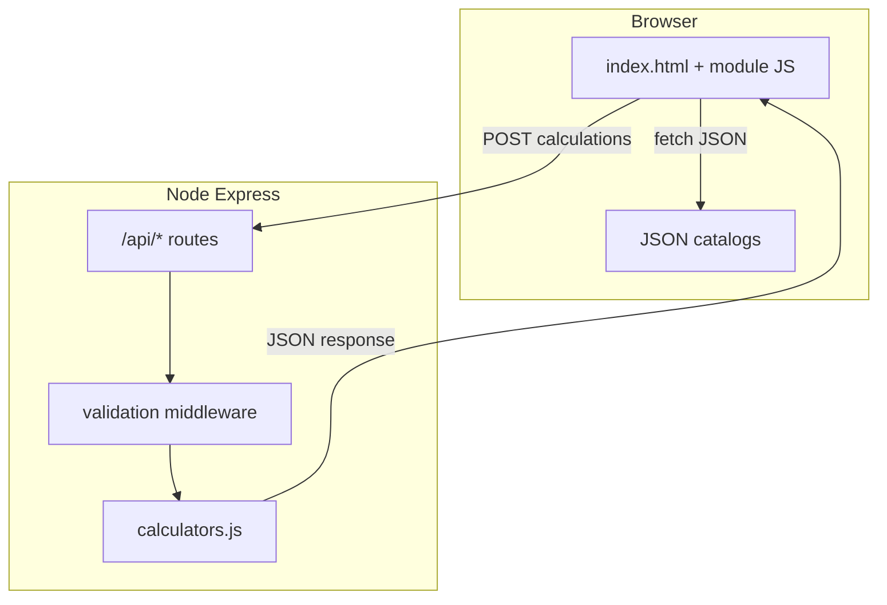

# System Information

**Born2Be Steel — Structural Steel Design System**  
Technical reference for developers, maintainers, educators, and repository recipients.

| Item | Detail |
|------|--------|
| **Primary documentation companion** | `System Documentation.md` (module defaults, Excel governance, data dictionary) |
| **Public repository** | [https://github.com/markings199/BORN2-BE-STEEL-](https://github.com/markings199/BORN2-BE-STEEL-) |
| **Typical production deployment** | Vercel-hosted Express entry (`api/index.js`, `vercel.json`); see root `README.md` |

---

## 1. System overview

### 1.1 System name and purpose

- **Name:** Born2Be Steel (Steel Design System).
- **Purpose:** Browser-accessible structural steel **design and analysis** calculators aligned with **workbook-style (Excel-referenced)** engineering workflows, **AISC 360–oriented** practice where implemented, and educational use.
- **Educational and engineering scope:** Interactive limit-state checks, capacity/demand views, analysis calculators with intermediate factors, and JSON-backed section/material catalogs. Outputs are intended to **teach and approximate** code-style checks; they are **not** a substitute for peer review, sealed drawings, or jurisdiction-specific design responsibility (see **§11 Engineering disclaimer**).

### 1.2 Supported functional modules

| Module | Typical UI coverage | Notes |
|--------|---------------------|--------|
| **Tension** | Design calculator; analysis (non-staggered / staggered); capacity & demand | Heavy frontend workbook logic (e.g. `tension-page-ui.js`); API tension checks where wired |
| **Compression** | Design; analysis; capacity database | Slenderness / buckling-related chains; capacity JSON + API list endpoint |
| **Beam (bending)** | Design; analysis; capacity (with / without deflection modes) | Flexural demand/capacity and selection-style flows per workbook alignment |
| **Shear** | Design; analysis; capacity | Web shear, coefficients, LRFD/ASD branches per implementation |
| **Tension rod** | Dedicated rod design / check flows | API-backed design sheet style calculations |
| **Section properties & summaries** | AISC-style catalog lookup, property display, `section-properties` API | Acts as the primary “**reporting**” surface for merged section data (not a separate Next.js `/report` route) |

**Navigation model:** The shipped application is a **single-page shell** (`steel-design-system/frontend/index.html`) with **in-page sections** and **hash-based** deep links (not `/tension`-style App Router paths unless added externally).

### 1.3 Execution model

- **Browser-based calculation:** A large portion of engineering output is computed **in the browser** via vanilla JavaScript workbooks tied to DOM inputs.
- **Server-backed calculation:** Selected flows call **same-origin** `POST /api/calculations/*` (Express + validation + `calculators.js`).
- **Offline / PWA:** There is **no** registered service worker or `manifest.json` in this repository. After initial load, the browser may **cache static assets** per normal HTTP caching; **full offline operation is not guaranteed**. Long sessions should assume network availability for first load and any API-dependent actions.

### 1.4 Intended users

- Engineering students and structural engineering learners  
- Designers and checkers exploring workbook-aligned workflows  
- Educators demonstrating limit states and method (LRFD/ASD) branching  
- Maintainers extending modules or regenerating JSON from Excel  

---

## 2. Technology stack (as implemented in this repository)

> **Accuracy note:** This codebase is a **Node.js + Express** server with a **vanilla HTML/CSS/JavaScript** frontend. It does **not** ship Next.js 16, the React 19 App Router, TypeScript application sources, Tailwind v4, `next-pwa`, Vitest, Zod, or `npm run build` in the current `package.json`. If the product roadmap migrates to that stack, this document should be revised to match the new layout and tooling.

### 2.1 Runtime and server

| Layer | Technology | Role |
|-------|------------|------|
| Runtime | **Node.js** (LTS recommended) | Executes server and export/regression scripts |
| HTTP | **Express 4** | API routes, JSON body parsing, static `frontend/` |
| Security / ops | **helmet**, **cors**, **morgan**, **express-rate-limit** | Headers, logging, API rate limiting |
| Configuration | **dotenv** | `PORT`, `NODE_ENV`, CORS, rate-limit tuning (`server.js`) |

### 2.2 Frontend

| Layer | Technology | Role |
|-------|------------|------|
| Markup | **HTML5** | Large SPA shell `frontend/index.html` |
| Scripting | **Vanilla JavaScript** (IIFE / global helpers, e.g. `SteelAPI`, `SteelCalculator`) | Module UI, workbooks, recompute pipelines |
| Styling | **CSS** (`style.css`, `responsive.css`) | Layout, workbook cell styling, responsive rules |

### 2.3 Data and tooling

| Item | Technology | Role |
|------|------------|------|
| Runtime datasets | **JSON** under `frontend/data/` | Grades, sections, capacity tables, ordering data |
| Workbook maintenance | **`xlsx`** (devDependency in `steel-design-system/package.json`) | `scripts/export-*.js` regenerates JSON from Excel |
| Dev reload | **nodemon** | `npm run dev` |

### 2.4 Package management and scripts

- **Package manager:** **npm** (lockfiles may be present per clone).
- **Application root (development):** `steel-design-system/` (contains `server.js`, `package.json`, `frontend/`, `backend/`, `scripts/`).
- **Deployment wrapper root:** Repository root `package.json` runs `node steel-design-system/server.js` for some hosting layouts.

**Defined npm scripts (application `package.json`):**

- `npm start` — production-style server  
- `npm run dev` — nodemon  
- `npm run export:*` — Excel → JSON pipelines  
- `npm run test:bending-design`, `test:bending-analysis`, `test:shear-design`, `test:shear-analysis` — **Node regression** scripts (not Vitest)

**Not currently defined:** `npm run lint`, `npm test`, `npm run build` — see **§8** for quality workflow guidance.

### 2.5 Build system

- There is **no separate frontend bundler** (Webpack/Vite/tsc) in the delivered tree; the browser loads scripts and JSON directly.
- “Build” in practice means **verify server start**, **run regression scripts**, and optionally **regenerate JSON artifacts** after Excel changes.

### 2.6 Environment and runtime expectations

- **OS:** Windows, macOS, or Linux (path separators differ; examples use POSIX-style where generic).
- **Ports:** Default **3040**; `server.js` can probe upward if busy (`PORT`, `PORT_TRY_COUNT`).
- **Body limit:** JSON payloads capped (e.g. **100 kb** — see `server.js` / README).

---

## 3. Development workflow and system history (reference model)

This section describes the **observed engineering process** reflected in the repository, not a private historical log.

1. **Module requirement planning** — Discipline-specific panels (tension, compression, bending, shear, rods) with design vs analysis vs capacity sub-modes.
2. **I/O workflow design** — Spreadsheet metaphor: yellow-style inputs, computed outputs, method-dependent labels (LRFD/ASD).
3. **Separation of calculation logic** — Pure math helpers in `backend/utils/calculators.js`; workbook-long chains in `frontend/js/*-workbook.js` and `*-page-ui.js`.
4. **Frontend–backend integration** — `frontend/js/api.js` / `calculator.js` POST to `/api/calculations/*`; catalog `GET /api/steel/*`.
5. **Excel comparison and validation** — Workbook sheets named in code comments; export scripts materialize JSON; regression scripts lock key numeric parity.
6. **Real-time computation** — `input` / `change` listeners and central `recomputeAll`-style functions update dependent fields synchronously in the DOM.
7. **Persistence** — **Limited** `localStorage` for a few UX preferences (not a full project-save engine); see **§7**.
8. **Reporting** — Section properties UI + `POST /api/calculations/section-properties` for merged reporting payloads.
9. **Verification and deployment** — Local smoke (`/api/health`), regression scripts, Vercel wrapper (`api/index.js`, `vercel.json`).

---

## 4. Project structure documentation

### 4.1 Repository layout (actual)

```text
/
├── api/index.js                 # Serverless / Vercel export of nested Express app
├── vercel.json                  # Rewrites + includeFiles for static frontend
├── package.json                 # Root wrapper (minimal deps, start script)
├── README.md                    # Clone-level overview and deployment notes
├── System Documentation.md      # Deep system + Excel governance
└── System Information.md        # This file
└── steel-design-system/         # Main application
    ├── app.js                   # Express app composition
    ├── server.js                # Listen + middleware + static
    ├── package.json
    ├── backend/
    ├── frontend/
    └── scripts/
```

### 4.2 Conceptual map (common SPA monorepo names → this repo)

| Conceptual area | Actual location | Purpose |
|-----------------|-----------------|--------|
| `src/app/` (routes/layout) | `frontend/index.html` + `frontend/js/main.js` (hash sections) | Application shell and navigation |
| `src/lib/calculations/` | `backend/utils/calculators.js`; `frontend/js/*-workbook.js`, `*-ui.js` | Formula implementations and workbook chains |
| `src/lib/data/` | `frontend/data/*.json` | Runtime catalogs and capacity tables |
| `src/lib/aisc/` | `frontend/data/aisc-sections.json` + `backend/models/steelData.js` | Section catalog load and lookup |
| `src/lib/report/` | `frontend/js/section-properties-ui.js`; `POST .../section-properties` | Property reporting and merged outputs |
| `src/lib/storage/` | Sparse `localStorage` usage in module scripts | Lightweight client persistence |
| `scripts/` | `steel-design-system/scripts/` | Excel export, extraction, regression |
| `README.md` | Root `README.md` + `steel-design-system/README.md` | Setup, API list, architecture |

### 4.3 `steel-design-system/backend/`

| Path | Purpose |
|------|---------|
| `routes/api.js`, `routes/calculations.js` | Mount health, steel catalog, calculation POST routes |
| `controllers/calculationController.js`, `steelController.js` | Request handling; compression capacity list, section queries |
| `middleware/validation.js` | Request validation before calculation |
| `models/steelData.js` | Loads AISC JSON and related lookups |
| `utils/calculators.js` | Shared formula helpers for API responses |

### 4.4 `steel-design-system/frontend/`

| Path | Purpose |
|------|---------|
| `index.html` | SPA layout, module sections, inline styles where used |
| `css/` | Global and responsive styling |
| `js/` | All interactive logic: API wrappers, tension/compression/bending/shear UI, workbooks |
| `data/` | Committed JSON datasets (grades, sections, capacities) |
| `assets/` | Imagery and static art |
| `pages/` | Thin HTML entry points / redirects to `index.html` hashes |

### 4.5 `steel-design-system/scripts/`

Node utilities to **read Excel** (via `xlsx`) and emit or verify `frontend/data/*`. Paths to `.xlsx` files are **hard-coded per script**; update filenames or symlinks when the workbook revision changes.

---

## 5. System architecture

### 5.1 High-level diagram



### 5.2 Data flow (typical)

1. **User input** — DOM fields, selects, method toggles, section pickers.  
2. **Validation** — Client-side guards; server-side schema in `validation.js` for API calls.  
3. **Calculation** — In-browser workbook functions and/or API calculators.  
4. **Output rendering** — Formatting helpers write to readonly fields and status labels.

### 5.3 Real-time recalculation

- Event-driven updates re-run dependent steps in a single thread (no Web Worker offload in baseline code).
- Shared inputs (e.g. steel grade, length) may be **mirrored** across design/analysis panels to keep workbook parity.

### 5.4 State management

- **No Redux/React state library** — state lives in the DOM and module-level JS variables.
- Initialization functions apply **Excel-referenced defaults** when panels first activate.

### 5.5 Persistence

- See **§7** — minimal `localStorage`; no encrypted project vault.

### 5.6 Deployment architecture (Vercel)

- `vercel.json` rewrites traffic to `api/index.js`, which includes nested static files from `steel-design-system/frontend/**/*`.

---

## 6. Engineering calculation system

### 6.1 Modular structure

- **By discipline:** Tension, compression, bending, shear, rods — separate JS modules and API routes where applicable.
- **By mode:** Design vs analysis vs capacity uses distinct UI blocks and sometimes distinct formula branches.

### 6.2 Reusable formulas

- **Backend:** `calculators.js` centralizes API-facing math with explicit assumptions (`notes` in responses where used).
- **Frontend:** Workbook files encode **cell-style dependency chains** (Excel parity comments in code).

### 6.3 Input validation

- Numeric parsing with safe fallbacks; enums for method and connection types on API routes.
- UI prevents obvious divide-by-zero paths in critical workbooks (defensive checks vary by module).

### 6.4 Units and conversion

- **Primary system:** **US customary / kip–inch** style fields (ksi, in, ft, kips) per labels.
- Conversions (e.g. **ft → in** for derived plate length) are implemented **explicitly** in module scripts; always verify against the referenced Excel sheet when changing a chain.

### 6.5 Dependency chains

- Downstream values (demand, nominal strength, design strength, utilization) depend on upstream geometry, material, and method factors — order of recomputation is handled by central recompute entry points per module.

### 6.6 Safety checks and engineering consistency

- Compare demand to governing capacity where implemented; status fields (`SAFE` / `UNSAFE` or equivalents) should not assert true when inputs are non-finite.
- **Excel remains the contractual reference** for workbook-mapped pages; see `System Documentation.md`.

---

## 7. Data persistence and “report” behavior

### 7.1 localStorage (current, illustrative)

- **Sparse usage** — e.g. UI preference keys such as compression capacity DB method, debug tail keys in development-oriented paths, section search memory.
- **Not** a full cross-module project save format.

### 7.2 Project bundle persistence

- **Not implemented** as a first-class bundled project file in the baseline repository. Any future “save project” feature should define schema versioning and migration.

### 7.3 Saved module workflow

- Users may rely on **browser form state** while the tab remains open; refresh generally resets to defaults unless future persistence is added.

### 7.4 Report generation logic

- **Section properties:** Merges catalog geometry with optional manual overrides via API (`section-properties`) and UI rendering.
- **Cross-module aggregation:** Not a single unified “report PDF” pipeline in-repo; export to external reporting would be an integration task.

### 7.5 Data recovery and limitations

- Clearing site data clears `localStorage`.
- JSON catalogs are **versioned in Git**; regenerate from Excel after workbook edits.

---

## 8. Testing and quality assurance

### 8.1 Current automated checks

From `steel-design-system/package.json`:

```bash
cd steel-design-system
npm run test:bending-design
npm run test:bending-analysis
npm run test:shear-design
npm run test:shear-analysis
```

These are **Node regression** drivers, not a general `npm test` harness.

### 8.2 Linting and unit tests

- **ESLint / Vitest / `npm run lint` / `npm test`:** Not configured in the current application `package.json`. Recommended for contributors:
  - Add ESLint + a minimal config for `frontend/js` and `backend/`.
  - Add Vitest or keep Node regression scripts as the numeric parity gate.
  - Wire `npm test` to invoke the chosen suite in CI.

### 8.3 Build verification

```bash
cd steel-design-system
npm start
```

Confirm `GET /api/health` returns success. Open `http://localhost:3040` (or printed port).

### 8.4 Engineering validation

- Re-run regression scripts after formula or JSON changes.
- Spot-check against the authoritative Excel workbook for the affected sheet(s).
- Document workbook filename changes in commit messages when scripts are updated.

### 8.5 Production readiness checklist

- Environment variables reviewed (`PORT`, rate limits, `NODE_ENV`).
- Rate limiting acceptable for expected traffic.
- Static assets included in deployment bundle (Vercel `includeFiles`).
- CORS posture matches hosting (same-origin vs split origins).

---

## 9. Repository setup and project execution

### 9.1 Prerequisites

- **Git**
- **Node.js** (LTS recommended)
- **npm**

### 9.2 Clone the repository

```bash
git clone https://github.com/markings199/BORN2-BE-STEEL-.git
cd BORN2-BE-STEEL-
```

> The cloned directory name follows GitHub defaults; if it differs, `cd` into your clone root (the folder that contains `steel-design-system/`).

### 9.3 Install dependencies

**Application (required for local development):**

```bash
cd steel-design-system
npm install
```

**Optional — root wrapper** (if you run commands from repository root):

```bash
cd ..   # back to repo root if needed
npm install
```

### 9.4 Start the development server

```bash
cd steel-design-system
npm run dev
```

Or without auto-reload:

```bash
npm start
```

### 9.5 Open the application

- Default: **[http://localhost:3040](http://localhost:3040)**  
- If the port is busy, watch the console for the chosen port.

### 9.6 Functional verification (manual)

Inside the SPA (not separate Next routes):

- Navigate via sidebar/header to **Tension**, **Compression**, **Bending**, **Shear**, **Tension rod**, **Section properties** (or equivalent labels in the UI).
- Change representative inputs and confirm computed fields update without console errors.
- Call **`curl http://localhost:3040/api/health`** (or use browser) to verify API availability.

### 9.7 Production-style run

```bash
cd steel-design-system
NODE_ENV=production npm start
```

(On Windows PowerShell, `$env:NODE_ENV="production"; npm start`.)

### 9.8 Regenerate data from Excel (maintainers)

Ensure the workbook path inside each script matches your local file name, then:

```bash
cd steel-design-system
npm run export:steel-grades
npm run export:aisc-sections
# …other export:* scripts as needed
```

---

## 10. Additional professional sections

### 10.1 System limitations

- Simplified or partial limit states in some API helpers (e.g. certain buckling modes omitted — see `calculators.js` comments and API `notes`).
- Not every workbook edge case may be exposed in UI.
- No multi-user auth or audit trail in baseline static app.

### 10.2 Known constraints

- Large `index.html` and script set — maintainability benefits from modularization over time without changing formulas unintentionally.
- Excel export scripts assume specific filenames/paths.

### 10.3 Engineering disclaimer

**This software is provided for education and preliminary analysis.** The authors and contributors are not liable for engineering decisions made using these tools. All designs must be verified by a qualified professional engineer against the governing building code, AISC specification, project criteria, and local practice.

### 10.4 Browser compatibility

- Target **evergreen desktop browsers** (current Chrome, Edge, Firefox, Safari).  
- Legacy IE is not a design target.  
- Mobile layouts use `responsive.css` but complex workbooks are optimized for wider viewports.

### 10.5 Offline behavior notes

- No PWA install flow in-repo.  
- API calls fail without network; pure frontend workbooks still run where they do not depend on live `fetch` to `/api`.

### 10.6 Performance considerations

- Full recompute on wide dependency graphs is acceptable for interactive typing; debouncing is module-specific if present.
- JSON catalogs should stay loadable as single files; very large catalogs may warrant lazy loading in future refactors.

### 10.7 Future scalability

- Optional migration to a **bundled** frontend (Vite/React) while preserving formula modules as imported libraries.
- Optional **Vitest** for unit tests on pure `calculators.js` functions.
- Optional **OpenAPI** documentation for `/api/calculations/*`.

### 10.8 Recommended maintenance workflow

- **Trunk-based or short-lived feature branches** with PR review.
- **Tag releases** when Excel baseline or JSON exports change materially.
- Update **both** `System Documentation.md` and this file when architecture or setup changes.

### 10.9 Formula verification workflow

1. Identify affected Excel sheet and cells.  
2. Implement or adjust code with traceable comments.  
3. Regenerate JSON if tabular data moved.  
4. Run relevant `npm run test:*` regression.  
5. Manual spot-check critical outputs vs Excel.

### 10.10 Version control recommendations

- Commit **JSON exports** and **script** changes together when workbook-driven data shifts.
- Avoid committing secrets; use `.env` locally (see nested `README.md` for variables).
- Prefer descriptive commit messages: module + behavior + workbook reference.

### 10.11 Coding standards and conventions

- Match existing file style (plain JS, function declarations, IIFE boundaries).
- Preserve **Excel cell references** in comments when adding formulas.
- Do not mix unrelated refactors with formula fixes in the same commit.

### 10.12 Error handling strategy

- API: validation errors with HTTP 4xx; server errors 5xx with safer messaging in production (`NODE_ENV`).
- UI: guard clauses, fallback display strings (`--`, empty), avoid throwing inside input handlers.

### 10.13 Recommended deployment workflow

- CI: `npm install` in `steel-design-system`, run regression scripts, smoke `npm start` + `/api/health`.
- CD: Vercel project linked to repo; confirm `vercel.json` includeFiles covers new static paths.

### 10.14 Repository management practices

- Keep **nested** `steel-design-system` as the single source of truth for application code.
- Root wrapper exists for **hosting** — document any duplicate dependency bumps in root `package.json` when security patches apply.

---

## Document control

| Version | Description |
|---------|-------------|
| 1.0 | Initial consolidated system information for GitHub delivery |

**Maintainer action:** Update the accuracy note in **§2** whenever the runtime stack materially changes.
